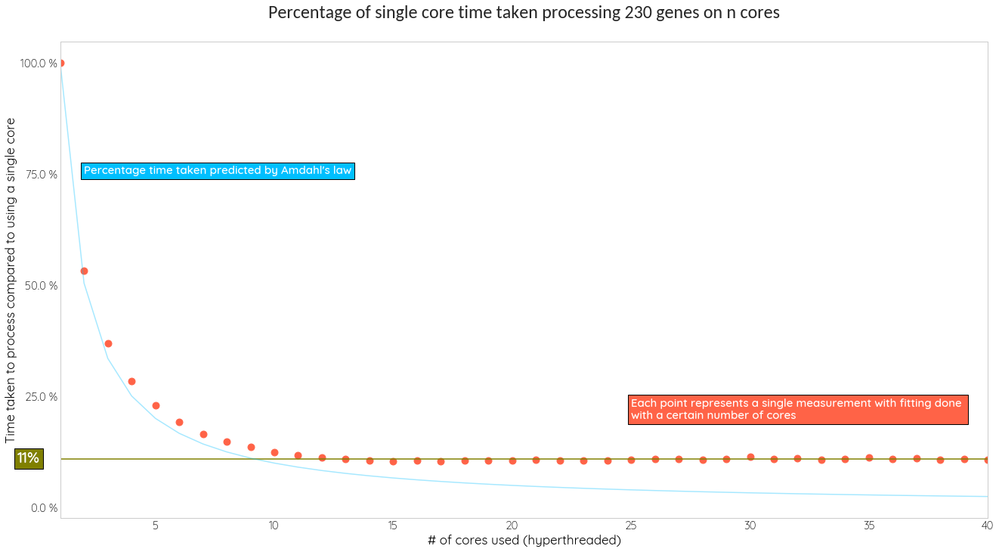

# aFC-n
aFC-n calculates the effect size of conditionally independent Expression Quantitative Trait Loci (eQTLs) based on allelic Fold Change (aFC), which could be used to predict genetically driven gene expressionan and allelic imbalance using conditional eQTL data. This script calculates aFCs using least squares optimization (levenberg-marquardt) for a set of eQTLs given a set of gene expressions and phased VCF file. See the [manuscript](https://www.nature.com/articles/s41467-024-44710-8) for method description.


## Installation

First install all the dependencies by doing:
```
pip3 -r requirements.txt
```

You will also need gcc and the python 3 development headers. If you are on a Debian based distro, do:
```
sudo apt install gcc python3-dev
```
Or on RHEL derivatives:
```
sudo dnf install gcc python3-devel
```

Finally, compile the cython files:
```
bash compile.sh
```
## Running the code effectively

Running the least squares optimization on several cores is highly recommended, see the plot below as well as the usage examples for more details.


## Usage Examples

Calculating aFCs without confidence intervals on a single core:
```
python3 afcn.py --vcf input_vcf.gz --expr input_expressions.gz --eqtl eqtls.txt --output output.txt
```

Calculating aFCs with confidence intervals on a single core:
```
python3 afcn.py --conf --vcf input_vcf.gz --expr input_expressions.gz --eqtl eqtls.txt --output output.txt
```

Calculating aFCs with confidence intervals using 12 cores:
```
python3 afcn.py -j 12 --conf --vcf input_vcf.gz --expr input_expressions.gz --eqtl eqtls.txt --output output.txt
```

Calculating aFCs with confidence intervals using 12 cores, with the expressions being in GCT format:
```
python3 afcn.py --gct -j 12 --conf --vcf input_vcf.gz --expr input_expressions.gz --eqtl eqtls.txt --output output.txt
```

Calculating aFCs with confidence intervals using 12 cores, with the expressions being log transformed and normalized (--logtransform will do log-transform, --normalize will do log-transform and normalization) :
```
python3 afcn.py --normalize --logtransform -j 12 --conf --vcf input_vcf.gz --expr input_expressions.gz --eqtl eqtls.txt --output output.txt
```

## Use flags

### Required

**--vcf** *VCF-FILE* Genotype VCF

**--expr** *EXPR-FILE* Expressions file

**--eqtl** *eQTL-FILE* File containing QTL to calculate allelic fold change

**--output** *OUT-FILE* Output file name

### Optional

**--nthreads** *N* Number of threads to do fitting on

**--conf** Calculate confidence intervals for aFC estimates

**--normalize** Expressions matrix has not been normalized yet

**--logtransform** Expressions matrix has not been log transformed yet

**--splitexpr** If set, the individual names in the expressions file will be split on “-” characters and the parts of the name on the two side of the first “-” character will be retained.

**--gct** If set, it will be assumed that the Expressions file is in gct format


## Input formats

IMPORTANT: The REF and ALT information in the VCF file should match the REF and ALT information in the EQTL matrix

### Expressions file

The script expects a gzipped file as an input for gene counts. The input gene counts should be in the format:
```
Name, sample_id1, sample_id2..
```
Where Name is a column that has the gene ID (such as ENSG00000224533), which should be in the same format as the gene IDs in the EQTL file.


### eQTLs

This file should contain gene IDs, variant IDs that match - it can also contain other stuff, but it needs to contain at least these two columns:
```
gene_id	variant_id other_stuff1 other_stuff2...
```


### VCF file

```
#CHROM  POS     ID      REF     ALT     QUAL    FILTER  INFO  sample_id1  sample_id2...
```
where #CHROM is the chr # POS is the position, ID is the variant ID in the format chr1_13550_G_A_b38, REF is the reference allele, ALT is the alternative allele. A tabix index needs to be generated for the gzipped vcf file:

```
bgzip vcf_file.vcf && tabix -p vcf vcf_file.vcf.gz
```

## Output file

Your output will be your input EQTL matrix, except that the resulting columns will be added as the additional columns at the end.

### By default

**log2_aFC** - the resulting aFC values 

**log2_aFC_error** - Standard error of the aFCs

**log2_aFC_c0** - The residual from the fit

### With the --conf flag

**log2_aFC_min_95_interv** - The lower 95% conf interval for the aFC value

**log2_aFC_plus_95_interv** - The upper 95% conf interval for the aFC value

**log2_aFC_c0_min_95_interv** - The lower 95% conf interval for the residual

**log2_aFC_c0_plus_95_interv** - The upper 95% conf interval for the residual


